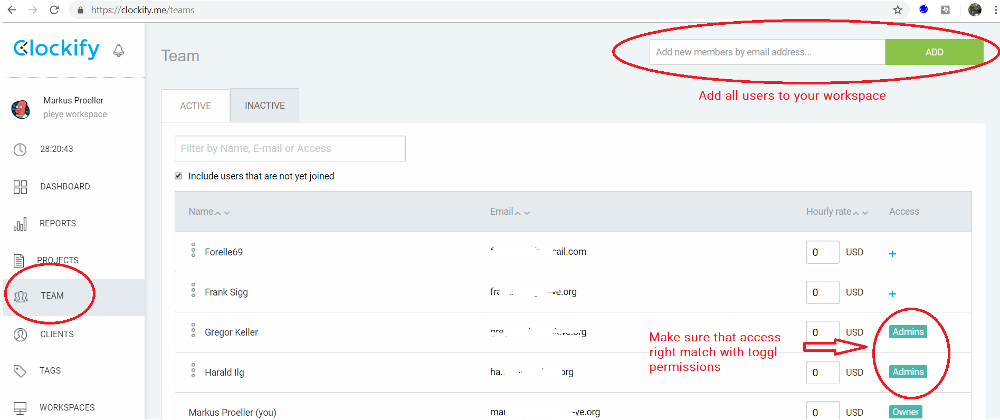

# toggl2clockify
Migrate data from toggl to clockify

**No warranty that the tools works as expected. Read the following lines CAREFULLY and TEST it on a non productive system!**

# Quick start

Migration consists of five steps (which are described in detail below):
1. Prepare clockify workspace 
2. Modify **config.json**
3. Run the migration tool **bin/toggl2clockify.exe** (or **python toggl2clockify.py** on other platforms)
4. After the import go through **log.txt** and search for "WARNING" entries (if you're unsure post a bug report)
5. Finalize migration (archive projects in clockify which were archived on toggl) by running **bin/toggl2clockify.exe --skipClients --skipProjects --skipEntries --skipTags --doArchive**

# Migration Guide

## Prepare clockify workspace


## Configure import process
Open the file config.json. The file already contains all required keywords (**TogglKey** , **ClockifyKeys**, **ClockifyAdmin** and **StartTime**).

### Configure toggl and clockify API keys
You need your **toggl** API key (https://toggl.com/app/profile) and the **clockify** API keys of **all users** to be migrated (every clockify user has to open https://clockify.me/user/settings ).
Put the keys in the file **config.json**. 

Suppose your toggl API key is ABCDEF and you want to migrate **yourself** (clockify API key 123456) and a **second user** (clockify API key XYZCDF).

```bash
{
  "TogglKey": "ABCDEF",
  "ClockifyKeys": ["123456", "XYZCDF"]
}
```

### Configure clockify admin mail address
You have to configure the mail address of **one clockify workspace admin**. Suppose you have admin rights on the clockify workspace and your clockify account mail is **me@info.org**

```bash
{
  "TogglKey": "ABCDEF",
  "ClockifyKeys": ["123456", "XYZCDF"],
  "ClockifyAdmin": "me@info.org"
}
```

### Configure start time of import
Enter the start time from when you want to import your entries. This string is parsed by python's dateutil parser (details: https://dateutil.readthedocs.io/en/stable/parser.html).

Some valid examples:

- "2012-01-19"
- "2012-01-19 17:21:00"
- "2012-01-19 17:21:00 CST"

```bash
{
  "TogglKey": "ABCDEF",
  "ClockifyKeys": ["123456", "XYZCDF"],
  "ClockifyAdmin": "me@info.org",
  "StartTime": "2019-01-19"
}
```

### Configure end time of import (optional)
Entering an end time until when you want to import entries is optional. If not given, all time entries until NOW are imported. The EndTime string follows the same formation rules as the StartTime string.


```bash
{
  "TogglKey": "ABCDEF",
  "ClockifyKeys": ["123456", "XYZCDF"],
  "ClockifyAdmin": "me@info.org",
  "StartTime": "2019-01-19"
  "EndTime": "2019-05-14"
}
```

### Configure workspace of import (optional)

The last step is to configure the workspace to be imported. You can also give a list of multplie workspaces, but this is an **untested** feature.
Make sure that the toggl and clockify workspace names match **exactly** (no spaces, UPPER/lower case).

```bash
{
  "TogglKey": "ABCDEF",
  "ClockifyKeys": ["123456", "XYZCDF"],
  "ClockifyAdmin": "me@info.org",
  "StartTime": "2019-01-19",
  "Workspaces": ["myWorkspace"]
}
```


## Run the import

### Regular import
If you're on windows you can run the file 
```bash
bin/toggl2clockify.exe
```

directly or through python by
```bash
python toggl2clockify.py
```

make sure you have a file called **config.json in the folder from where you invoke the program**.

Run
```bash
bin/toggl2clockify.exe --help 
```
to get a list of all supported commands.

**You can run the tool as often as you whish. All time entries, projects, clients and tags are checked for existance before being added to the clockify workspace**

### Remarks on archived projects
**If you have archived projects in the toggl workspace, use the flag doArchive at the very end when you are sure, that all data has been migrated successfully**

Your very last invokatin of the import tool should be
```bash
bin/toggl2clockify.exe --skipClients --skipProjects --skipEntries --skipTags --doArchive
```

When you try to add time entries for projects, which are **already archived in clockify**, the tool gets messed up:
- the entries are added without project reference
- the "entry exists" check doesn't work and the time entries will be added as duplicates on each invokation of the tool

Before you start the migration, you should **unarchive all clockify projects** first.

### Check the log

The tool creates a file **log.txt** parse the contents for "WARNING" entries. Make sure to understand them or post a bug report if things don't work as expected.

## What is migrated
- All clients of the workspace
- All tags of the workspace
- The following project attributes are migrated:
    - name
    - client
    - isPublic
    - billable
    - color
    - membership

    - NOT MIRGATED: tasks, hourlyRate, estimate

- The following time entry attributes are migrated:
    - start
    - billable
    - description
    - projectID
    - userID
    - end
    - tagIds
    
    - NOT MIRGATED: taskId, timeInterval (not sure what purpose this serves), isLocked
    
## What is not migrated
- Tasks
- User groups